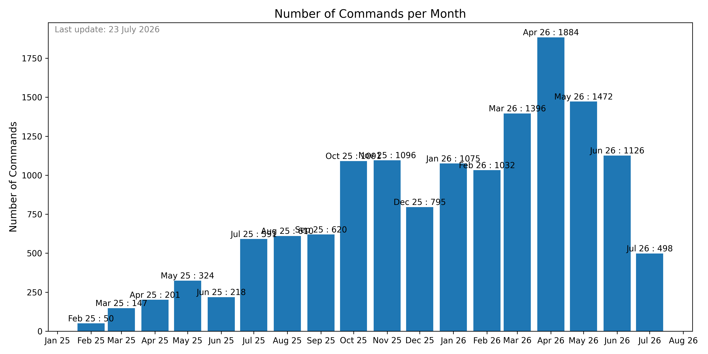
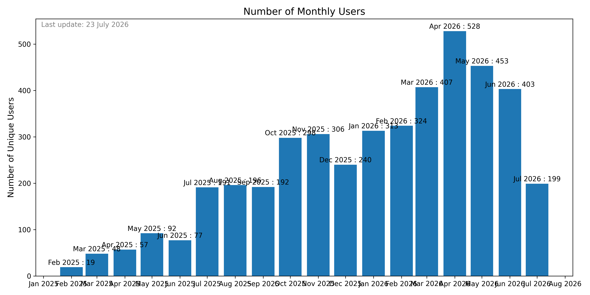
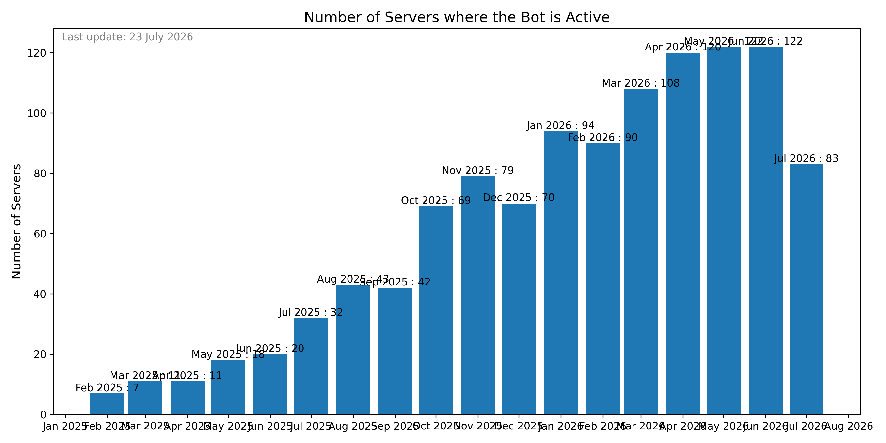

# MetaPano
A Discord bot created to offer build recommendations for the game Dofus Touch.

The recommandations are stored in a simple database :   
[DB diagram](https://dbdiagram.io/d/PanoDB-67c5d9b5263d6cf9a010af9b)

If you want to talk about this bot, test it, or follow its news you can join my discord server : 
[Dofus Touls]( https://discord.gg/TcrNrRE5QV)

You can also invite the bot on your server to test it :
[Metapano Invite Link](https://discord.com/oauth2/authorize?client_id=1288167324586872842)


## Usage Analytics
<!-- UPDATE_DATE -->
> **Last update : 23 July 2026**
<!-- UPDATE_DATE -->

### Number of Commands per Month


### Number of Monthly Users


### Number of Servers where the Bot is Active



<!-- 
```mermaid
erDiagram
    STUFF {
        DB_id INT PK
        DB_surl CHAR
        Nom VARCHAR
        PA INT
        PM INT
        PO INT
        Invo INT
    }
    ELEMENT {
        ElementID INT PK
        Nom VARCHAR
    }
    STUFF_ELEMENT {
        ElementID INT FK
        DB_id INT FK
    }
    CLASSE {
        ClasseID INT PK
        Nom VARCHAR
    }
    STUFF_CLASSE {
        ClasseID INT FK
        DB_id INT FK
    }

    STUFF_ELEMENT }|..|{ STUFF : has
    STUFF_ELEMENT }|..|{ ELEMENT : relates
    STUFF_CLASSE }|..|{ STUFF : has
    STUFF_CLASSE }|..|{ CLASSE : relates -->
